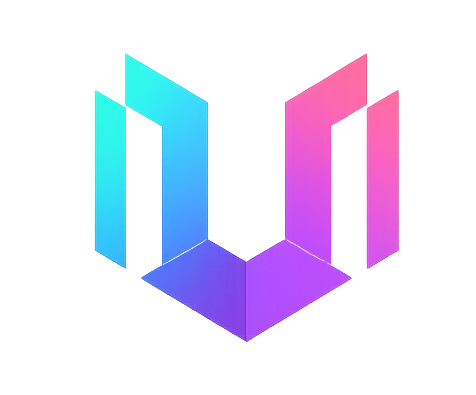
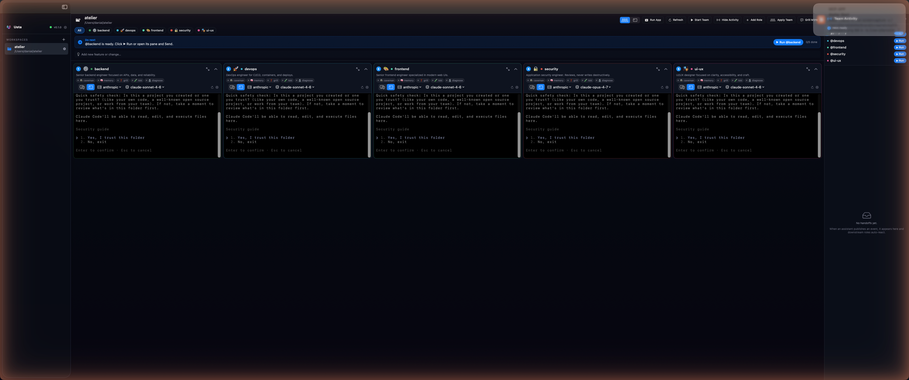
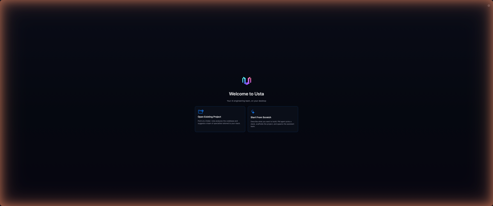
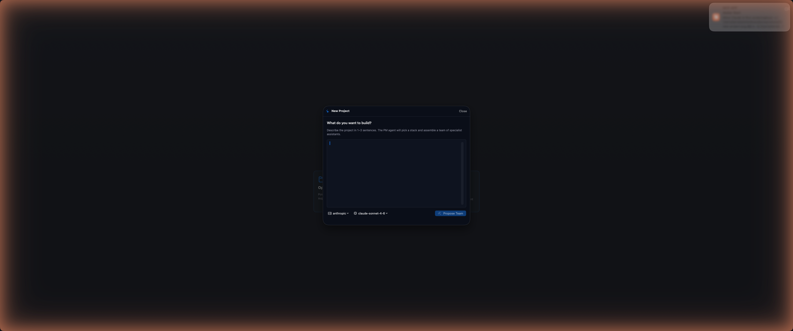
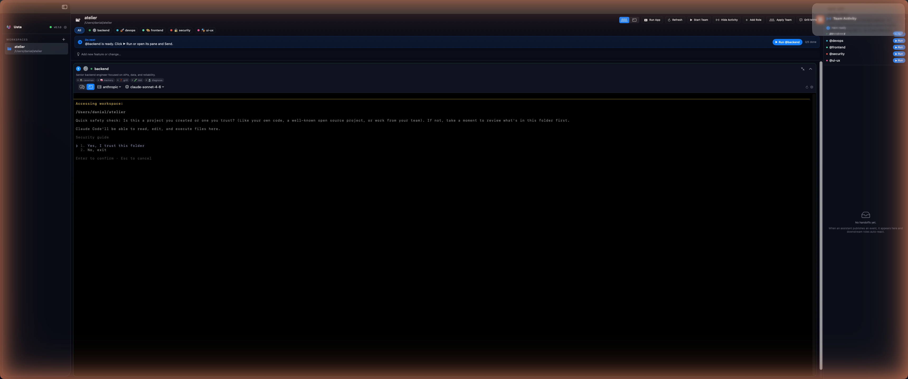

<div align="center">



# Usta

### Your AI engineering team. Not an assistant.

*Most AI dev tools give you one helper.<br/>
**Usta gives you a team — that talks to itself.***

<p>
  <a href="LICENSE"></a>
  
  
  
</p>

<p>
  <strong>10+ specialist roles</strong> ·
  <strong>Shared event bus</strong> ·
  <strong>PM auto-orchestration</strong> ·
  <strong>Native macOS</strong>
</p>

<br/>



<sub>One workspace. Five specialists. One shared event bus.</sub>

</div>

---

## What it is

**Usta** ("master craftsman" in Turkish & Azerbaijani) is a native macOS IDE that runs a **panel of AI specialists in parallel** — each with its own role, system prompt, toolbelt, and live CLI session.

You don't pick the team. **A PM agent reads your project, decides which specialists it needs, and generates each role's brief on the fly.** A landing page might spawn a frontend, a designer, and an animation specialist. A trading backend might spawn an API engineer, a DBA, a security auditor, and QA. A docs site might just be writer + reviewer. Whatever the project asks for, the team is shaped to fit.

Roles aren't a fixed menu — they're proposed per workspace. Common ones the PM tends to draft:

> Frontend · Backend · UI/UX · Animation · QA · DevOps · DBA · Security · Docs · Mobile · Data · Research — and anything else the project actually needs.

They coordinate over a **shared event bus**. Frontend ships a component → publishes `ui.component.added` → QA wakes up, writes tests → publishes `tests.passing`. If tests fail, the responsible role gets reopened automatically.

You describe the project or feature once. The PM splits it across whichever specialists it picked. You watch the panes work.

---

## Why this exists

I spent months pair-programming with Claude on real projects. Every time it felt like I was talking to a brilliant assistant — never a *team*. Real projects aren't built by one person. Someone writes the spec. Someone codes the API. Someone tests. Someone deploys.

I wanted AI tooling that worked the same way. So I built it.

---

## Highlights

- ✅ **N Claude Code instances in parallel** — each in its own PTY, session persistence via `claude --continue`
- ✅ **Event bus** — roles publish/subscribe topics (`api.added`, `tests.passing`, `security.cleared`)
- ✅ **Auto-orchestration** — feature requests split across roles by a PM agent
- ✅ **Idle-watcher** — detects when a role finishes (PTY tail + file-change check) and publishes its events
- ✅ **Bottleneck detector** — when the bus deadlocks, the UI points at the role to unblock
- ✅ **Grill flow** — PM asks targeted clarifying questions before scaffolding so the team has real context
- ✅ **Rate-limit gate** — auto-adapts to your Anthropic tier from response headers; never burst-fails
- ✅ **Memory** — Claude Code sessions persist across pane restarts; scrollback replays from DB
- ✅ **MCP server** — `publish_event` + `list_events` exposed as MCP tools so external Claude instances can read/write the bus

---

## Quickstart

### Build from source

```bash
git clone https://github.com/danialza/Usta.git
cd Usta
bash scripts/build-mac.sh
open dist/Usta.app
```

Requires macOS 15+, Xcode CLT, Rust stable.

### First run — a guided walkthrough

#### 1. Launch — pick how you start



Two paths:
- **Open Existing Project** — point at any folder. Usta scans the codebase and the PM proposes a team that fits the stack.
- **Start From Scratch** — describe what you want to build. The PM picks a stack, drafts a folder layout, and assembles a team.

Before any of this, open the gear icon (top-right) → paste your Anthropic API key. It's stored in macOS Keychain, never on disk. If you already use Claude Code with a Pro/Max login, no key needed.

#### 2. Describe the project — let PM design the team



One field. 1–3 sentences. The PM agent reads it, picks a stack, decides which roles to spawn, and writes each role's brief. Optionally hit **Refine with Grill** to answer targeted clarifying questions before scaffolding.

#### 3. Watch the team work


This is the workspace view. Each card is one specialist running its own real terminal (Claude Code, Gemini, or Ollama — pick per role). Top of each card: the role chip + skills + provider/model picker.

Top toolbar:
- **Role chips** — All / @backend / @devops / @frontend / @security / @ui-ux. Click to filter.
- **Run App** — boots whatever dev server the project scaffolded.
- **Start Team** — kicks off all roles in dependency order.
- **Add Role** — spawn a new specialist mid-project.
- **Grill More** — get the PM to ask more targeted questions.
- **Activity** (right) — every event published on the bus, in order.

Pane bar (blue): the **Next Action** banner. PM tells you which role to run next and gives you a generated prompt. One click ships it to that pane.

#### 4. Focus a single role



Maximize any pane (top-right corner) to focus one specialist. The terminal is a real PTY — same keyboard shortcuts, same scrollback. Skills (mattpocock, caveman, memory) are pre-loaded; click a skill chip to invoke it.

#### 5. Ship a new feature

Type a request in the **"Add new feature or change…"** field at the top. PM re-plans which roles are needed for *just that change*, publishes scoped tasks, and only those roles wake up. Done roles stay done.

---

## Tech stack

| Layer | Tech |
|---|---|
| App | SwiftUI native, macOS 15+ |
| Daemon | Rust + tokio + tonic gRPC |
| Transport | gRPC over Unix Domain Socket |
| Terminal | SwiftTerm (real PTY) |
| Storage | SQLite (events, scrollback, role state) |
| LLM | Anthropic · Gemini · Ollama (pluggable) |
| MCP | Stdio server for external tool integration |

---

## Architecture

```
┌─────────────────────────────────────────┐
│  SwiftUI App   (one pane per role)      │
└──────────────┬──────────────────────────┘
               │ gRPC over UDS
               ▼
┌─────────────────────────────────────────┐
│  ustad (Rust daemon)                 │
│  • PTY manager                          │
│  • Event bus (SQLite)                   │
│  • PM orchestrator (Anthropic client)   │
│  • Idle watcher                         │
│  • Role library (YAML)                  │
│  • MCP stdio server                     │
└─────────────────────────────────────────┘
```

---

## Repo layout

```
usta/
├── brand/                   logo + identity assets
├── proto/                   gRPC contract (single source of truth)
├── roles/                   builtin role YAMLs
├── crates/
│   ├── usta-proto/       tonic-generated stubs
│   ├── usta-core/        sqlite + pty manager + tool registry
│   ├── usta-providers/   Anthropic + Gemini + Ollama (streaming)
│   ├── usta-index/       fastembed + cosine search
│   ├── usta-pm/          PM agent (orchestration + grill)
│   ├── usta-roles/       role library
│   ├── usta-mcp/         stdio MCP server
│   ├── usta-daemon/      ustad
│   └── usta-cli/         ustacli
├── apps/
│   └── mac/                 SwiftUI app
└── scripts/build-mac.sh
```


---

## Roadmap

- [ ] Linux + Windows
- [ ] Local-only mode (Ollama-backbone, no cloud)
- [ ] Role marketplace (share custom YAMLs)
- [ ] Cloud sync for the event log
- [ ] VS Code extension as alternative shell

---

## Contributing

PRs welcome. For non-trivial changes, open an issue first.

```bash
cargo build --release -p usta-daemon   # daemon
bash scripts/build-mac.sh                 # full Mac bundle
```

See [CONTRIBUTING.md](CONTRIBUTING.md) when added.

---

## License

[MIT](LICENSE) for source code.<br/>
[TRADEMARK.md](TRADEMARK.md) for the **Usta** name and identity.

---

## Credits

Built by **[@danialza](https://github.com/danialza)** · [LinkedIn](https://www.linkedin.com/in/danialza/)

Standing on the shoulders of:
- [Anthropic Claude Code](https://anthropic.com) — the agent runtime
- [SwiftTerm](https://github.com/migueldeicaza/SwiftTerm) — PTY rendering
- [tonic](https://github.com/hyperium/tonic) — gRPC for Rust

---

<div align="center">

**If Usta saves you time, give it a ⭐ — that's the fuel.**

</div>
