<div align="center">


# Usta

### Your AI engineering team. Not an assistant.

*Most AI dev tools give you one helper.<br/>
**Usta gives you a team — that talks to itself.***

<p>
  <a href="LICENSE"></a>
  
  
  
</p>

<p>
  <strong>10+ specialist roles</strong> ·
  <strong>Shared event bus</strong> ·
  <strong>PM auto-orchestration</strong> ·
  <strong>Native macOS</strong>
</p>

<br/>


<sub>One workspace. A full team of specialists. One shared event bus.</sub>

</div>

---

## What it is

**Usta** ("master craftsman" in Turkish & Azerbaijani) is a native macOS IDE that runs a **panel of AI specialists in parallel** — each with its own role, system prompt, toolbelt, and live CLI session.

You don't pick the team. **A PM agent reads your project, decides which specialists it needs, and generates each role's brief on the fly.** A landing page might spawn a frontend, a designer, and an animation specialist. A trading backend might spawn an API engineer, a DBA, a security auditor, and QA. A docs site might just be writer + reviewer. Whatever the project asks for, the team is shaped to fit.

Roles aren't a fixed menu — they're proposed per workspace. Common ones the PM tends to draft:

> Frontend · Backend · UI/UX · Animation · QA · DevOps · DBA · Security · Docs · Mobile · Data · Research — and anything else the project actually needs.

They coordinate over a **shared event bus**. Frontend ships a component → publishes `ui.component.added` → QA wakes up, writes tests → publishes `tests.passing`. If tests fail, the responsible role gets reopened automatically.

You describe the project or feature once. The PM splits it across whichever specialists it picked. You watch the panes work.

---

## Why this exists

I spent months pair-programming with Claude on real projects. Every time it felt like I was talking to a brilliant assistant — never a *team*. Real projects aren't built by one person. Someone writes the spec. Someone codes the API. Someone tests. Someone deploys.

I wanted AI tooling that worked the same way. So I built it.

---

## Highlights

- ✅ **N Claude Code instances in parallel** — each in its own PTY, session persistence via `claude --continue`
- ✅ **Event bus** — roles publish/subscribe topics (`api.added`, `tests.passing`, `security.cleared`)
- ✅ **Auto-orchestration** — feature requests split across roles by a PM agent
- ✅ **Idle-watcher** — detects when a role finishes (PTY tail + file-change check) and publishes its events
- ✅ **Bottleneck detector** — when the bus deadlocks, the UI points at the role to unblock
- ✅ **Grill flow** — PM asks targeted clarifying questions before scaffolding so the team has real context
- ✅ **Rate-limit gate** — auto-adapts to your Anthropic tier from response headers; never burst-fails
- ✅ **Memory** — Claude Code sessions persist across pane restarts; scrollback replays from DB
- ✅ **MCP server** — `publish_event` + `list_events` exposed as MCP tools so external Claude instances can read/write the bus

---

## Quickstart

**Step 1 — Download & install**

Grab the latest `Usta-macOS.dmg` from [Releases](https://github.com/danialza/Usta/releases). Open it and drag **Usta.app** into your **Applications** folder.

**Step 2 — Run this command in Terminal**

```
xattr -dr com.apple.quarantine /Applications/Usta.app
```

**Step 3 — Launch the app**

Open **Usta** from Applications (or Spotlight). The daemon spawns automatically.

### First run — a guided walkthrough

#### 1. Welcome — pick how you start

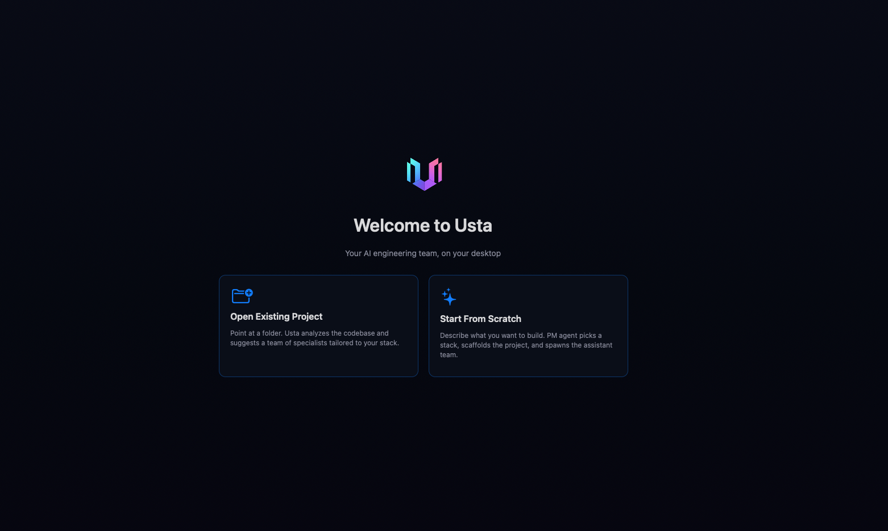

Two entry paths:
- **Open Existing Project** — point Usta at any folder. The PM agent scans the codebase and proposes a team that fits the stack.
- **Start From Scratch** — describe what you want to build. The PM picks a stack, drafts a folder layout, and assembles a team.

#### 2. Settings — paste your API keys (one time)

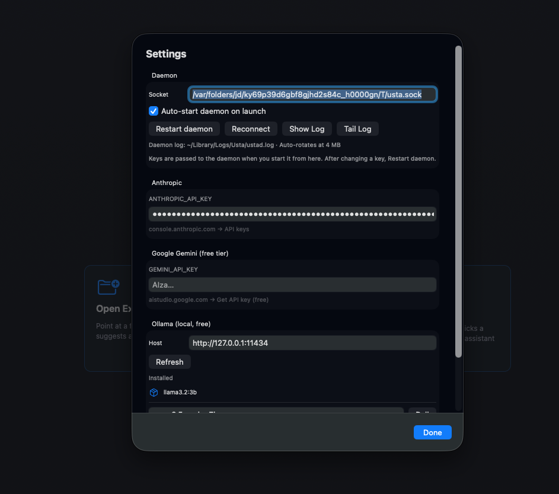

Click the gear icon (top-right). Three providers, mix as you like:

- **Anthropic** — your `sk-ant-…` key for Claude. Stored in macOS Keychain, never on disk.
- **Google Gemini (free tier)** — get a key at [aistudio.google.com](https://aistudio.google.com). Generous free tier.
- **Ollama (local, free)** — Refresh to detect locally installed models. Pull from the box if missing.

The daemon log lives at `~/Library/Logs/Usta/ustad.log`. **Show Log** / **Tail Log** open it instantly. When you hit **Done**, the daemon restarts with the new keys.

#### 3. Describe what you want to build

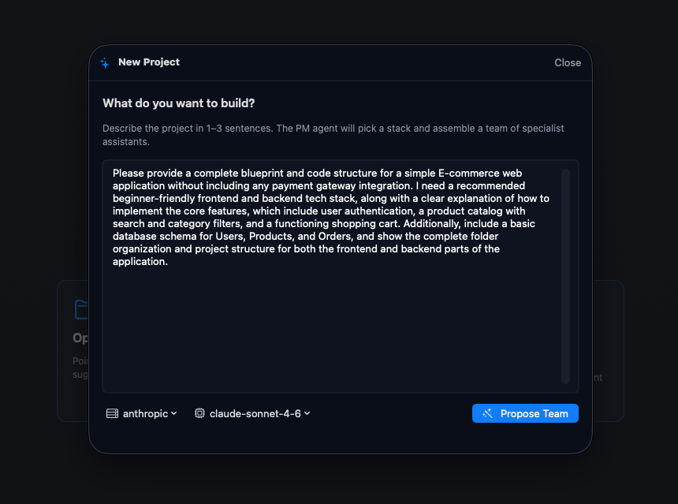

One field, 1–3 sentences. The clearer your description, the better the team. Pick the provider + model used to plan (defaults to `anthropic / claude-sonnet-4-6`). Hit **Propose Team**.

#### 4. PM proposes a team


The PM picks a name (`ShopHub`), drafts a one-paragraph project summary, picks a stack (Next.js 14, Prisma, Postgres, NextAuth, Jest + Playwright…), and lays out **first steps** in plain English — who does what, in what order.

#### 5. Review and edit the team

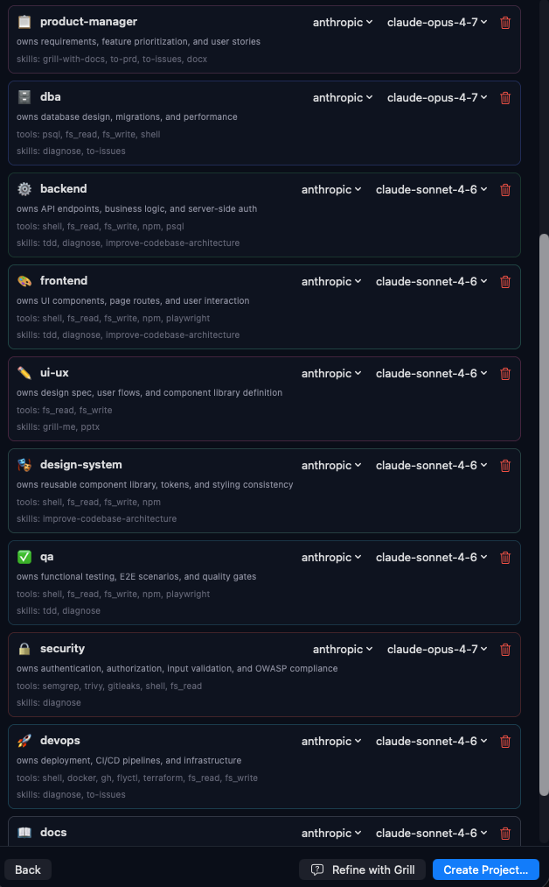

The proposal is editable. Each row is one specialist with:

- **Provider / model picker** — change to Gemini, Ollama, claude-opus, whatever fits the role.
- **Tools / skills** — what the role can use (`shell`, `fs_read`, `fs_write`, `npm`, `playwright`, …).
- **Trash icon** — drop a role.
- **+ Add Role** — append a new one (form below).

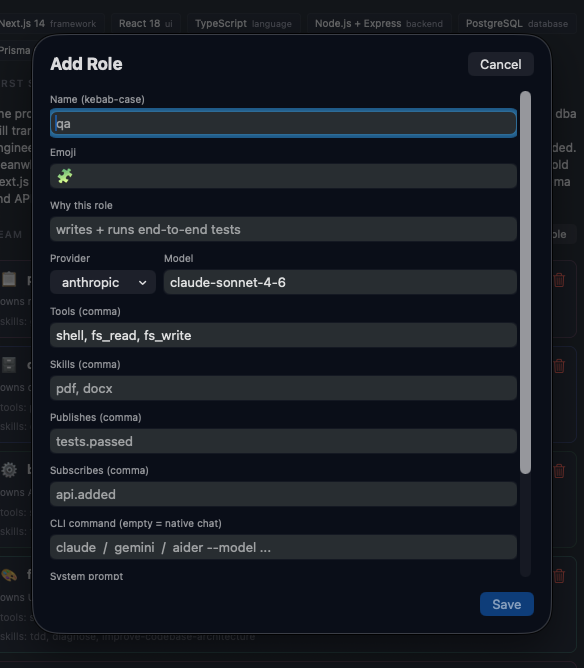

Manual role editor: name + emoji + why this role + provider/model + tools + skills + which events it **publishes** + which events it **subscribes** to + optional custom CLI command + system prompt.

#### 6. (Optional) Grill — refine before scaffolding

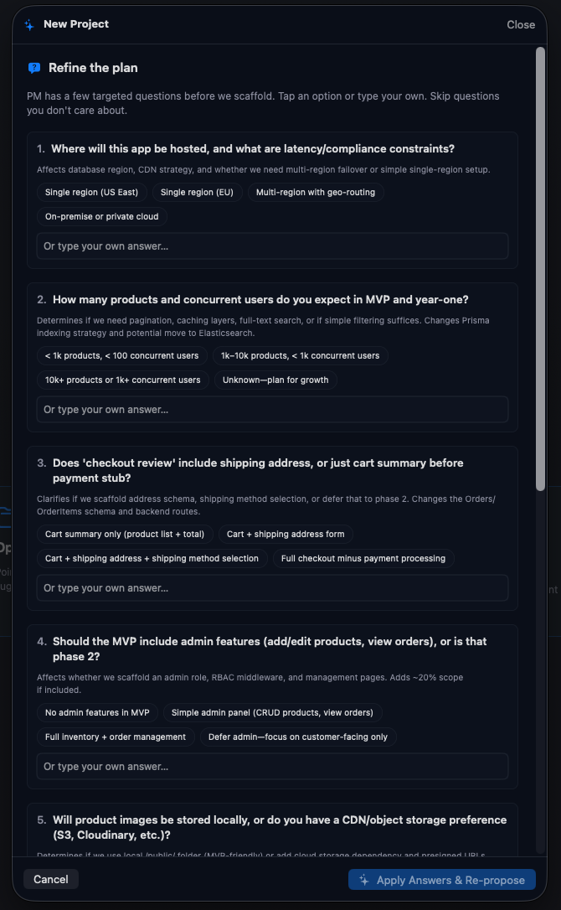

If you want the PM to ask sharper clarifying questions before writing any code, hit **Refine with Grill**. You get a focused Q&A:

> Where will this app be hosted? Will it have latency/compliance constraints?
> Should "checkout review" include shipping address, or summary before payment?
> Should the WIP include role-based features?

Your answers go straight into each role's brief.

When you're happy, hit **Create Project…**. Usta scaffolds the repo, writes the role YAMLs, and lands you in the workspace.

#### 7. The workspace — your team, working


Each card is one specialist running its own real PTY. The **blue banner** at top is the **Next Action** — PM tells you which role should act next and gives you a one-click generated prompt.

**Top toolbar** (zoom):

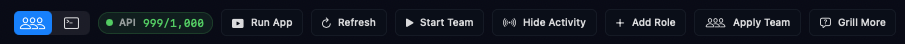

- **All / per-role chips** — filter the grid by role.
- **API 999 / 1,000** — live Anthropic rate-limit counter. Never burst-fails.
- **Run App** — boots whatever dev server the project scaffolded.
- **Refresh** — re-scan event bus for changes.
- **Start Team** — kicks off all roles in dependency order.
- **Hide Activity** — collapse the right-side activity feed.
- **Add Role** — spawn a new specialist mid-project.
- **Apply Team** — re-apply role YAMLs after edits.
- **Grill More** — get the PM to ask more targeted questions about the current state.

#### 8. Focus a single role

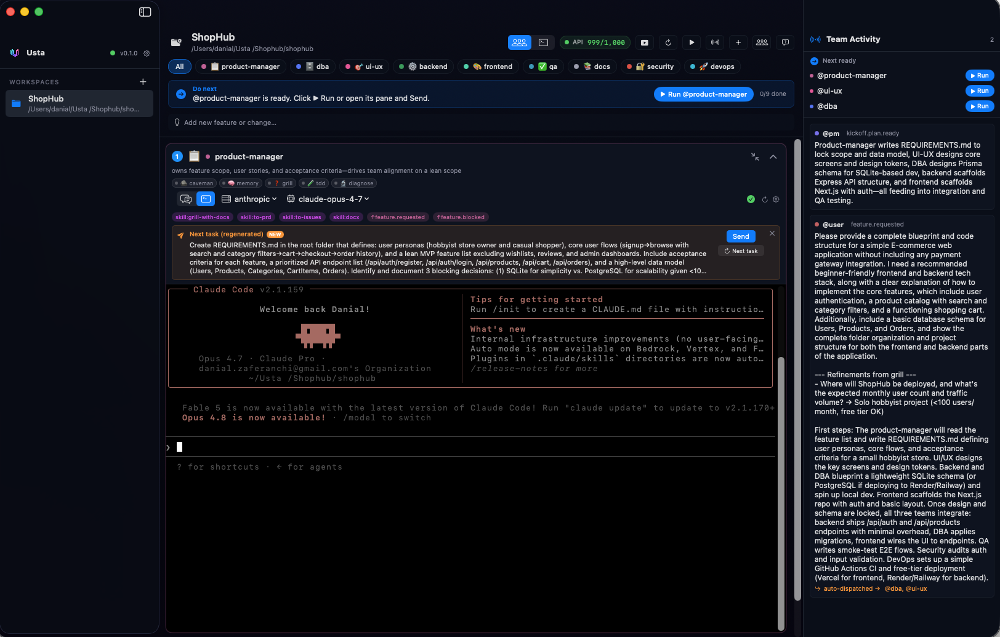

Click the maximize button on any pane to focus one specialist. The terminal is a real PTY — keyboard shortcuts, scrollback, everything. The blue banner above shows the **scoped task** the PM gave this role.

**Skills row** (zoom):

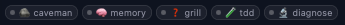

Pre-loaded skills you can invoke with one click: `caveman` (terse mode), `memory` (persistent notes), `grill` (clarification), `tdd`, `diagnose`. The role's YAML lists which skills are active by default.

#### 9. Watch the event bus

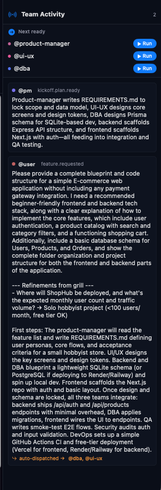

Every event published on the bus appears here in order. When a role announces `api.added`, every subscriber to that topic wakes up. The activity feed is the source of truth for who did what, when.

#### 10. Ship a new feature

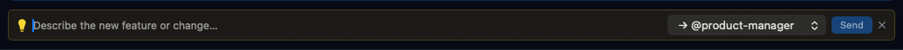

Type any request in the **"Describe the new feature or change…"** bar. PM re-plans which roles need to act for *just that change*, publishes scoped tasks, and only those roles wake up. Roles that were already done stay done. Pick a target role from the dropdown (default: `→ @product-manager`) or let the PM decide.

---

## Tech stack

| Layer | Tech |
|---|---|
| App | SwiftUI native, macOS 15+ |
| Daemon | Rust + tokio + tonic gRPC |
| Transport | gRPC over Unix Domain Socket |
| Terminal | SwiftTerm (real PTY) |
| Storage | SQLite (events, scrollback, role state) |
| LLM | Anthropic · Gemini · Ollama (pluggable) |
| MCP | Stdio server for external tool integration |

---

## Architecture

```
┌─────────────────────────────────────────┐
│  SwiftUI App   (one pane per role)      │
└──────────────┬──────────────────────────┘
               │ gRPC over UDS
               ▼
┌─────────────────────────────────────────┐
│  ustad (Rust daemon)                 │
│  • PTY manager                          │
│  • Event bus (SQLite)                   │
│  • PM orchestrator (Anthropic client)   │
│  • Idle watcher                         │
│  • Role library (YAML)                  │
│  • MCP stdio server                     │
└─────────────────────────────────────────┘
```

---

## Repo layout

```
usta/
├── brand/                   logo + identity assets
├── proto/                   gRPC contract (single source of truth)
├── roles/                   builtin role YAMLs
├── crates/
│   ├── usta-proto/       tonic-generated stubs
│   ├── usta-core/        sqlite + pty manager + tool registry
│   ├── usta-providers/   Anthropic + Gemini + Ollama (streaming)
│   ├── usta-index/       fastembed + cosine search
│   ├── usta-pm/          PM agent (orchestration + grill)
│   ├── usta-roles/       role library
│   ├── usta-mcp/         stdio MCP server
│   ├── usta-daemon/      ustad
│   └── usta-cli/         ustacli
├── apps/
│   └── mac/                 SwiftUI app
└── scripts/build-mac.sh
```


---

## Roadmap

- [ ] Linux + Windows
- [ ] Local-only mode (Ollama-backbone, no cloud)
- [ ] Role marketplace (share custom YAMLs)
- [ ] Cloud sync for the event log
- [ ] VS Code extension as alternative shell

---

## Contributing

PRs welcome. For non-trivial changes, open an issue first.

```bash
cargo build --release -p usta-daemon   # daemon
bash scripts/build-mac.sh                 # full Mac bundle
```

See [CONTRIBUTING.md](CONTRIBUTING.md) when added.

---

## License

[MIT](LICENSE) for source code.<br/>
[TRADEMARK.md](TRADEMARK.md) for the **Usta** name and identity.

---

## Credits

Built by **[@danialza](https://github.com/danialza)** · [LinkedIn](https://www.linkedin.com/in/danialza/)

Standing on the shoulders of:
- [Anthropic Claude Code](https://anthropic.com) — the agent runtime
- [SwiftTerm](https://github.com/migueldeicaza/SwiftTerm) — PTY rendering
- [tonic](https://github.com/hyperium/tonic) — gRPC for Rust

---

<div align="center">

**If Usta saves you time, give it a ⭐ — that's the fuel.**

</div>
